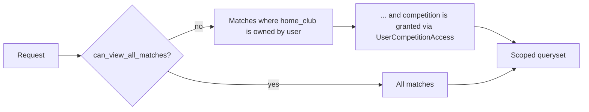
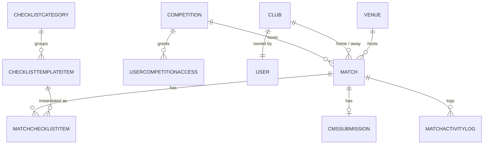
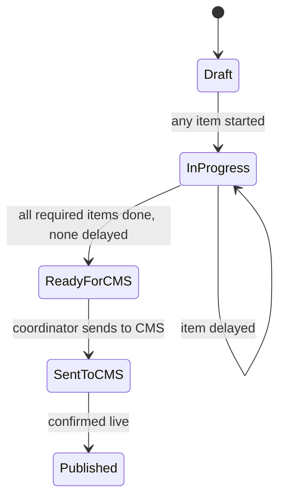

# Webook Match Tracker

Match-day operations platform for Roshn Saudi League (RSL) clubs. Coordinators track everything a match needs before it can go live on the CMS — tickets, gates, key visuals, team confirmations — and managers get a single, real-time view of where every match stands.


---

## Table of contents

- [Overview](#overview)
- [Core concepts](#core-concepts)
- [Architecture](#architecture)
- [Data model](#data-model)
- [Roles & permissions](#roles--permissions)
- [Match / CMS lifecycle](#match--cms-lifecycle)
- [Match-day checklist](#match-day-checklist)
- [Dashboards & reports](#dashboards--reports)
- [Design system](#design-system)
- [Tech stack](#tech-stack)
- [Project structure](#project-structure)
- [Getting started](#getting-started)
- [Management commands](#management-commands)
- [Known issues / notes](#known-issues--notes)

---

## Overview

Before this system, match-day prep lived across spreadsheets and group chats — no single place showed which matches were at risk of missing their CMS deadline, and there was no record of who did what, or when.

Webook Match Tracker replaces that with:

- A **live dashboard** of every match — live, upcoming, and past — with alerts for matches entering the prep window with pending items.
- A **checklist system** (7 categories, 30+ template items) tracked per match, with required vs. optional items.
- A **CMS status workflow** that's *computed automatically* from checklist completion instead of typed in manually.
- **Reports** for missing requirements and coordinator workload, scoped to what each user is allowed to see.
- A **back-office control panel** for managers to administer clubs, venues, competitions, users, and checklist templates.

## Core concepts

| Term | Meaning |
|---|---|
| **Club** | One of the 18 RSL clubs. Each club has one owning coordinator user. |
| **Competition** | A league/tournament (referred to as "Section" in the Control Panel UI). Grants scoped access. |
| **Match** | A single fixture: home/away clubs, venue, round, kickoff time, and CMS status. |
| **Checklist item** | One prep task on one match (e.g. "Ticket prices added"). Has its own status. |
| **CMS status** | Where a match stands in the publishing pipeline — see [lifecycle](#match--cms-lifecycle). |
| **Coordinator** | A club-owner user who prepares that club's home matches. |

## Architecture

The project is split into four Django apps with a clear separation of concerns:

```
matches/         Core data: Club, Venue, Competition, Match, access grants
checklists/      Checklist templates + per-match checklist items + CMS submissions
operations/      Coordinator-facing app: dashboard, match detail/live view, reports
control_panel/   Back-office CRUD for managers (matches, clubs, venues, users, templates)
config/          Django project settings, URL routing, shared context processors
```

**Scoping is centralized.** Every queryset of matches a user can see passes through `operations/permissions.py`:

- `can_view_all_matches(user)` — true for `Super Admin` / `Operations Manager` groups.
- `get_visible_matches(user, queryset)` — for everyone else, filters matches down to the clubs they own **and** the competitions they've been explicitly granted (`UserCompetitionAccess`).
- `MatchScopedQuerysetMixin` — a mixin used by nearly every view in `operations/` so this scoping is applied consistently rather than re-implemented per view.



## Data model



| Model | App | Notes |
|---|---|---|
| `Competition` | matches | League/tournament; UI label "Section" |
| `Club` | matches | 18 clubs; `owner` FK ties a club to its coordinator user |
| `Venue` | matches | Stadiums; UI label "Stadium" |
| `Match` | matches | Central record; carries `cms_status` |
| `UserCompetitionAccess` | matches | Grants a coordinator visibility into a competition |
| `ChecklistCategory` | checklists | The 7 reusable prep categories |
| `ChecklistTemplateItem` | checklists | Required/optional item definitions per category |
| `MatchChecklistItem` | checklists | One row per match × template item; drives `cms_status` |
| `CMSSubmission` | checklists | CMS hand-off record for a match |
| `MatchActivityLog` | operations | Audit trail — every status change / checklist update |

## Roles & permissions

| | **Operations Manager / Super Admin** | **Club coordinator** |
|---|---|---|
| Match visibility | All matches, all clubs, all competitions | Only matches where their club is home, in competitions they're granted |
| Control Panel access | Yes — full CRUD | No |
| Reports | Workload & missing-requirements, all coordinators | Own matches only |
| Checklist & CMS actions | On any match | On their own matches only |

Roles are Django `Group`s (`Operations Manager`, `Super Admin`, `Club Manager`), created via the `setup_roles` management command. Group membership plus `Club.owner` plus `UserCompetitionAccess` together decide what a user sees — there's no separate "permission" model beyond that.

## Match / CMS lifecycle

`Match.cms_status` is **not** set by hand — it's recalculated every time a checklist item is saved (`Match.refresh_checklist_status()`), based on how many *required* items are done vs. delayed:



Once a match reaches **Sent to CMS** or **Published**, further checklist edits no longer move its status backward automatically — it's frozen unless a manager changes it explicitly via `MatchCMSStatusUpdateView`.

## Match-day checklist

Seeded via `seed_checklists`, the checklist has 7 categories:

| Category | Example items |
|---|---|
| Event settings | Poster uploaded, stadium image, sponsor banner, zone selected, refund policy reviewed |
| Tickets | Types created, prices added, quantities added, sale dates, tickets activated |
| Ticket allocations | Home / away / common / blocked / accessibility allocation |
| Gates & admins | Gates created, admins assigned, gate emails mapped |
| Manage teams | Home/away team confirmed, team + common channel mapped |
| KVs | Key visuals received from design, uploaded, reviewed on web + app |
| CMS submission | Final review completed, sent to CMS, CMS confirmation received |

Each item is marked `is_required` or optional — only required items count toward "Ready for CMS."

## Dashboards & reports

- **Operations dashboard** (`/operations/`) — live matches, matches ready for ticket sale, prep-window alerts, matches needing post-match reports, starting-soon matches. Supports HTMX partial reloads via `?view=` filters.
- **Missing requirements report** — cross-match view of outstanding required checklist items, filterable by club / competition / round.
- **Coordinator workload report** — remaining (not-yet-published) matches grouped by coordinator, club, and round, sorted worst-backlog-first with a visual progress indicator per row.
- **Match detail / live view** — per-match checklist, CMS status control, activity log, and slug editor.

## Design system

Colors are sourced from Figma design tokens (`static/design_tokens.css`), exported for both light and dark palettes and switched automatically via `prefers-color-scheme` — no manual toggle needed. `static/operations/styles.css` consumes those tokens through a layer of semantic variables (`--primary`, `--surface`, `--border`, etc.), so every page in the app follows the same brand automatically, including dark mode.

Navigation is a fixed left sidebar (`templates/operations/base.html`) with the Webook logo, active-link highlighting, and role-based visibility (Control Panel link hidden from coordinators).

## Tech stack

| | |
|---|---|
| Framework | Django 6.0 |
| Database | SQLite (default `db.sqlite3`) |
| Frontend interactivity | HTMX (partial page swaps, no SPA framework) |
| Bulk data | pandas + openpyxl (Excel import/export of matches) |
| Config | `python-dotenv` (`.env` file) |

See `requirements.txt` for exact pinned versions.

## Project structure

```
config/                     Django settings, root URLconf
matches/                    Club, Venue, Competition, Match models + Excel import commands
checklists/                 Checklist templates, per-match items, CMS submissions
operations/                 Dashboard, match detail/live, reports, permissions
control_panel/              Back-office CRUD (matches, clubs, venues, users, templates)
static/
  design_tokens.css          Figma-derived brand colors (light + dark)
  operations/styles.css      App-wide styles, consumes design tokens
  images/                    Webook logo assets
templates/
  operations/                 base.html (sidebar shell), dashboard, match views, reports
  registration/login.html     Login page
  admin/                      Custom admin templates
```

## Getting started

```bash
# 1. Clone and enter the project
git clone https://github.com/sendoo-m/Webook_Match_Tracker.git
cd Webook_Match_Tracker

# 2. Create and activate a virtual environment
python -m venv venv
venv\Scripts\activate        # Windows
source venv/bin/activate     # macOS / Linux

# 3. Install dependencies
pip install -r requirements.txt

# 4. Configure environment
copy .env.example .env       # Windows
cp .env.example .env         # macOS / Linux
# then edit .env and set a real DJANGO_SECRET_KEY

# 5. Set up the database
python manage.py migrate

# 6. Seed roles and checklist templates
python manage.py setup_roles
python manage.py seed_checklists

# 7. Create an admin user
python manage.py createsuperuser

# 8. Run the server
python manage.py runserver
```

Then sign in at `/login/` — an authenticated Super Admin lands on `/operations/` and has a **Control Panel** link in the sidebar to start adding clubs, venues, competitions, and users.

If you're importing existing fixtures from Excel, see [Management commands](#management-commands) below.

## Management commands

| Command | What it does |
|---|---|
| `setup_roles` | Creates the `Club Manager` and `Operations Manager` groups. Run once on a fresh install. |
| `seed_checklists` | Creates/updates the 7 checklist categories and their template items. Safe to re-run. |
| `generate_match_checklists` | Creates a `MatchChecklistItem` for every existing match × active template item. Run after adding matches or new template items. |
| `generate_cms_submissions` | Creates a `CMSSubmission` record for every match that doesn't already have one. |
| `import_matches --file <path.xlsx>` | Imports matches from a multi-sheet Excel workbook (generic format). |
| `import_rsl_club_matches --file <path.xlsx> [--sheets a,b]` | Imports matches from the per-club RSL workbook format (one sheet per club). |

## Known issues / notes

- **CMS status badge colors**: `templates/operations/reports/workload.html` and the match-list status badge build their CSS class as `badge-{{ match.cms_status|slugify }}`. Since `cms_status` values use underscores (e.g. `in_progress`), Django's `slugify` preserves the underscore, but the classes defined in `static/operations/styles.css` use hyphens (`.badge-in-progress`). Double-check this mapping if a status badge isn't picking up its color.
- **`matches` app is data-only**: `matches/urls.py` and `matches/views.py` are currently empty — all matches-related pages live in `operations/` and `control_panel/`. The `matches` app exists purely for its models, permissions helpers, and Excel import commands.
- **"Teams" / "Stadiums" / "Sections" in the Control Panel UI** map to the `Club`, `Venue`, and `Competition` models respectively — the URL names and view classes use the friendlier labels, so don't be surprised the models don't literally match the nav labels.
